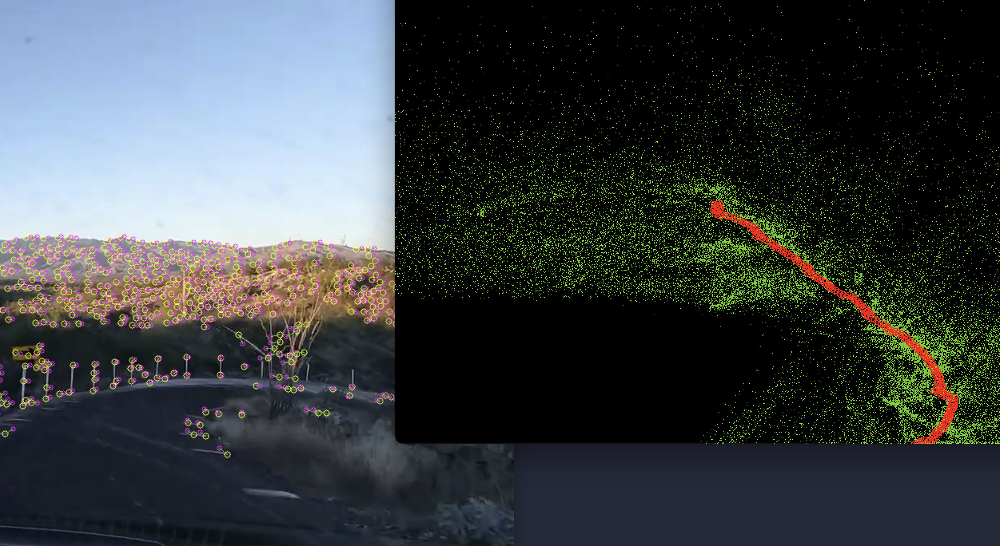

# SLAM

This is my take at implementing monocular SLAM from a single lens video.

Simultaneous localization and mapping (SLAM) is the computational problem of constructing or updating a map of an unknown environment.

It take any .mp4 video and construct a 3d cloud points from it in real time.

## Run & Execute

`python3 main.py`

Use your mouse / trackpad to move the camera around
